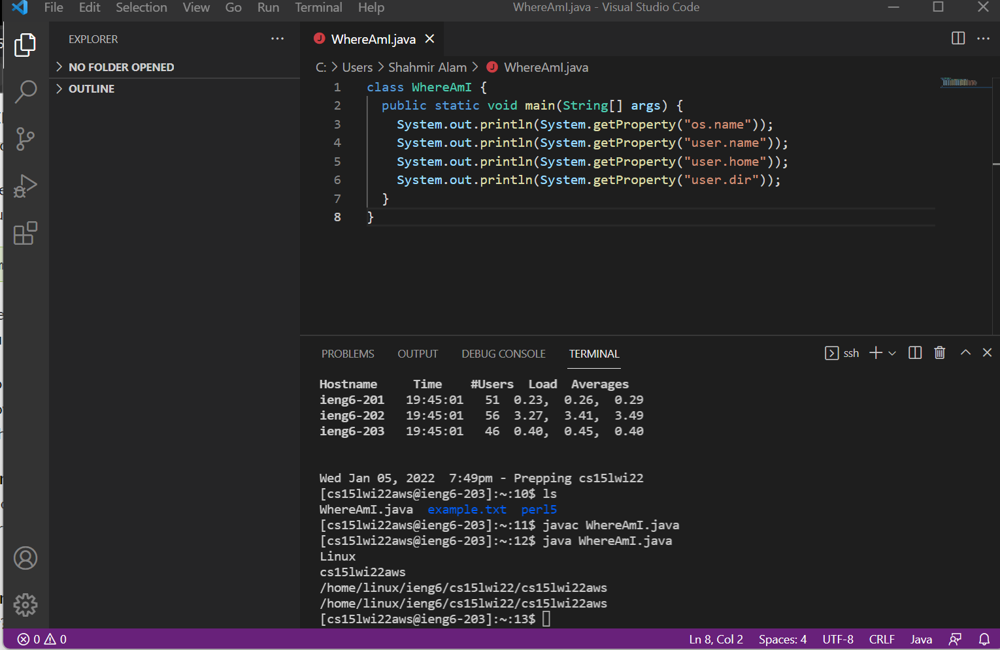

# Week # 2 - Lab Report

This a tutorial for incoming 15L students about how to log into a course-specific account on ieng6.

## Step # 1 - Installing VScode.


First things first. We will need to install VScode from [here.](https://code.visualstudio.com/). Pick your operating system, download and then follow instructions on screen.

After installation it should look like this.


## Step # 2 - Remotely Connecting.

Next up, you will need to look up your account info [here.](https://sdacs.ucsd.edu/~icc/index.php) Then you will need to open a new terminal through the "terminal menu". Now type in the following command in the terminal using YOUR account info:

```ssh cs15lwi22zz@ieng6.ucsd.edu```

Type in __yes__ to proceed.


## Step # 3 - Trying Some Commands

Lets try some commands.
Try:

```cd```

```ls```

```pwd```

```mkdir```

```cp```

> If you don't know a command. Don't try it.

Try some more commands:

```cd ~```

```cd```

```ls -lat```

```ls -a```

```ls <directory> where <directory> is /home/linux/ieng6/cs15lwi22/cs15lwi22abc```, where the ```abc``` is one of the other group members’ username

```cp /home/linux/ieng6/cs15lwi22/public/hello.txt ~/```

```cat /home/linux/ieng6/cs15lwi22/public/hello.txt```


## Step # 4 - Moving Files with scp

Now lets move files from your local machine to the remote server.

Create a file on your local machine and then type
```scp <filename> cs15lwi22zz@ieng6.ucsd.edu:~/```
  in the terminal from your local machine.



## Step # 5 - Setting an SSH Key

There is a way you can login to your remote server everytime without using your password.

Type in:
```
# on client (your computer)
$ ssh-keygen
Generating public/private rsa key pair.
Enter file in which to save the key (/Users/joe/.ssh/id_rsa): /Users/joe/.ssh/id_rsa
Enter passphrase (empty for no passphrase): 
Enter same passphrase again: 
Your identification has been saved in /Users/joe/.ssh/id_rsa.
Your public key has been saved in /Users/joe/.ssh/id_rsa.pub.
The key fingerprint is:
SHA256:jZaZH6fI8E2I1D35hnvGeBePQ4ELOf2Ge+G0XknoXp0 joe@Joes-Mac-mini.local
The key's randomart image is:
+---[RSA 3072]----+
|                 |
|       . . + .   |
|      . . B o .  |
|     . . B * +.. |
|      o S = *.B. |
|       = = O.*.*+|
|        + * *.BE+|
|           +.+.o |
|             ..  |
+----[SHA256]-----+
```

For Windows follow extra steps [here.](https://docs.microsoft.com/en-us/windows-server/administration/openssh/openssh_keymanagement#user-key-generation)

After that type in:
```
$ ssh cs15lwi22zz@ieng6.ucsd.edu
<Enter Password>
# now on server
$ mkdir .ssh
$ <logout>
# back on client
$ scp /Users/joe/.ssh/id_rsa.pub cs15lwi22@ieng6.ucsd.edu:~/.ssh/authorized_keys
# You use your username and the path you saw in the command above
```

Now you should be able to login without password.

## Final Step - Optimizing Remote Running

Here are some tips to help you better use this interface.

* You can write a command in quotes at the end of an ssh command to directly run it on the remote server, then exit. For example, this command will log in and list the home directory on the remote server:

```$ ssh cs15lwi22@ieng6.ucsd.edu "ls"```

* You can use semicolons to run multiple commands on the same line in most terminals. For example, try:

```$ cp WhereAmI.java OtherMain.java; javac OtherMain.java; java WhereAmI```

* You can use the up-arrow on your keyboard to recall the last command that was run

* You can use 'ls -a' command to view even the hidden files.


Lastly, If you didn’t get everything to work, that’s OK! There are multiple resourses on the internet for you get help from so keep TRYING!
