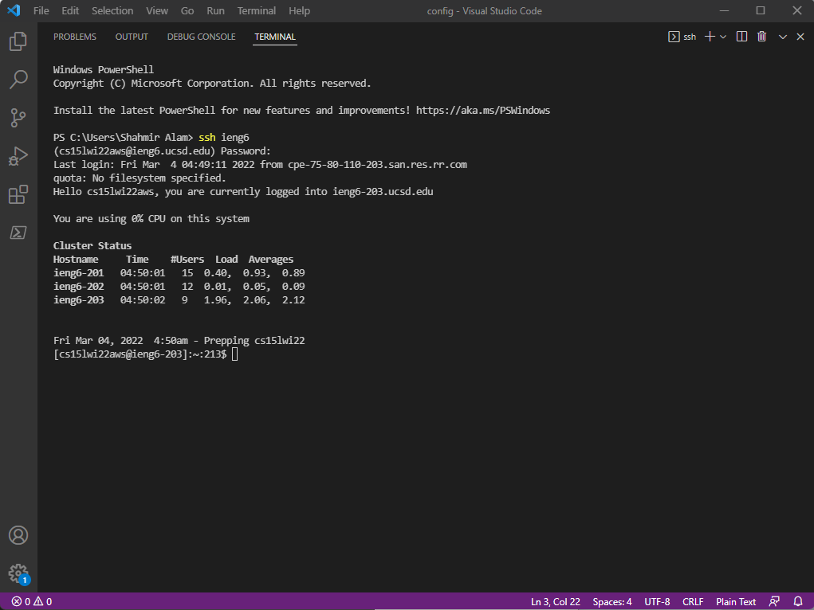

# Week 6 - Lab Report 3

I did "Group Choice 1 – Streamline ssh Configuration."

## Step # 1 - Config


I made a new file names config under ssh in my local route folder. Then used `~/.ssh/config` in my terminal to open the "config" file in VSCODE.

## Step # 2 - Editing Config


I edited the config file to add the following:
```
Host ieng6  
    HostName ieng6.ucsd.edu
    User cs15lwi22aws
```
Here, "ieng6" is a custom a alias. I can name it anything I desire.

## Step # 3 - ssh using alias



I then used `ssh ieng6` to get access my remote server. 

## Step # 4 - scp from local to remote using alias


In the last step, used the `scp` command to copy a from my local machine to my remote server. I confimed the copy was successfully sent. 