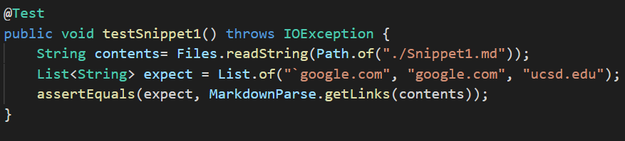
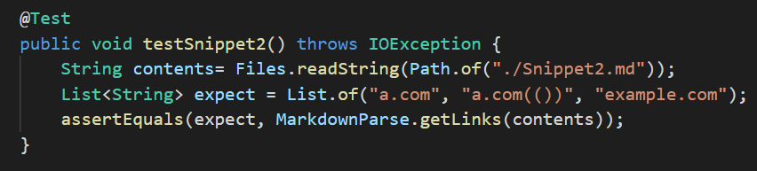
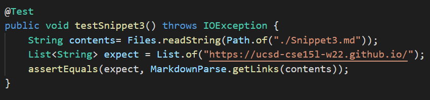

# Week 8 - Lab Report 4

Links to markdown-parse repository(s):
- [My MarkdownParse](https://github.com/ShahmirAlam/markdownParse)
- [The MarkdownParse We Reviewed](https://github.com/JessalynWang/markdown-parse)

## Snippet # 1
The Expect Output:
```
[`google.com, google.com, ucsd.edu]
```
I created `snippet1.md` and created a test method in `MarkdownParseTest` like this:


Result of My Code:
```
l) testSnippetl(MarkdownParseTest)
java.lang.AssertionError: expected:<[`google.com, google.com, ucsd.edu]> but was:<[url.com, `google.com, google.com, ucsd.edu]>
at org.junit.Assert.fail(Assert.java:89)
at org.junit.Assert.failNotEquals(Assert.java835)
at org.junit.Assert.assertEquals(Assert.java:I20)
at org.junit.AsJert.assertEqualJ(Assert.java:I46)
at MarkdownParseTest.testSnippetl(MarkdownParseTest.java:83)
```
Result of the Code I Reviewed:
```
l) testSnippetl{MarkdownParseTest)
java.lang.AssertionError: expected:<[`google.com, google.com, ucsd.edul> but was:<[url.com, `goog
le.com, google.com]>
at org.junit.Assert.rail(Assert.java:89)
at org.j unit.Assert.failNotEquals(Assert.java:835)
at org.j unit.Assert.assertEquals(Assert.java:I20)
at org.j unit.Assert.assertEquals(Assert.java:I46)
at MarkdownParseTest.testSnippetl(MarkdownParseTest. java: 76)
```

## Snippet # 2
The Expect Output:
```
[a.com, a.com(()), example.com]
```
I created `snippet3.md` and created a test method in `MarkdownParseTest` like this:


Result of My Code:
```
2) testSnippet2(MarkdownParseTest)
java.lang.AssertionError: expected:<[a.com, a.com(()), example.com]> but was:<[a.com, a.com((, example.com]>
at org.junit.Assert.fail(Assert.java:89)
at org.junit.Assert.failNotEquals(Assert.java:835)
at org.junit.Assert.assertEquals(Assert.java:I20)
at org.junit.Assert.assertEquals(Assert.java:I46)
at MarkdownParseTest.testSnippet2(MarkdownParseTest. j ava:90)
```
Result of the Code I Reviewed:
```
2) testSnippet2(MarkdownParseTest)
java.lang.AssertionError: expeIted:<[a.com, a.Iom(()), example.com]> but was:<[a.com, a.Iom((, ex
ample.coml>
at org.junit.Assert.fail(Assert.java89)
at org.junit.Assert.failNotEquals(Assert.java:835)
at org.junit.Assert.assertEquals(Assert.java:I20)
at org.junit.Assert.assertEquats(Assert.java:I46)
at MarkdownParseTest.testSnippet2(MarkdownParseTest.j ava:83)
```
## Snippet # 3
The Expect Output:
```
[https://ucsd-cse15l-w22.github.io/]
```
I created `snippet3.md` and created a test method in `MarkdownParseTest` like this:


Result of My Code:
```
3) testSnippet3(MarkdownParseTeJt)
java.lang.AssertionError: expected:<[https://ucsd-csel5l-w22.github.io/]> but was;<[]>
at org.junit.Assert.fail(Assert.java89)
at org.junit.Assert.failNotEquals(Assert.java:835)
at org.junit.Assert.assertEquals(Assert.java:I20)
at org.junit.Assert.assertEquals(Assert.javaI46)
at MarkdownParseTest.testSnippet3(MarkdownParseTest.j ava:97)
```
Result of the Code I Reviewed:
```
3) testSnippet3(MarkdownParseTest)
java.lang.AsJertionError: expected<[https://ucJd-csel5l-w22.github.io/]> but was:<[
https://.twitter.com

https ://ucsd-csel5l-w22.github. io/

, github.com
And there's still some more text after that.
[this link doesn't have a closing parenthesis for a whilel(https://cse.ucsd.edu/

at org.junit.Assert.fail(Assert.java:89)
at org.junit.Assert.failNotEquals(Assert.java835)
at org.junit.Assert.assertEquals(Assert.java:I20)
at org.junit.Assert.assertEquals(Assert.java:I46)
at MarkdownParseTest.testSnippet3(MarkdownParseTest. java:90)
```
## Questions:

### Q: Do you think there is a small (<10 lines) code change that will make your program work for snippet 1 and all related cases that use inline code with backticks? If yes, describe the code change. If not, describe why it would be a more involved change.
There is no complete solution for this in cases such as nested brackets. This be solved with the proper use of a stack frame, but it would be complicated and much longer than 10 lines.
### Q: Do you think there is a small (<10 lines) code change that will make your program work for snippet 2 and all related cases that nest parentheses, brackets, and escaped brackets? If yes, describe the code change. If not, describe why it would be a more involved change.
The solution will require more than 10 lines code change. We can use a stack ADT. We can first push a open paren into the stack, once we meet a open paren, push another open paren into the stack, once we met a close paren, pop a open paren out of the stack. once the stack is empty, stop and the index we at is the index of the closeParen, output the link. if the stack is not empty until we hit the start of next link, skip this and trun into next while loop.
### Q: Do you think there is a small (<10 lines) code change that will make your program work for snippet 3 and all related cases that have newlines in brackets and parentheses? If yes, describe the code change. If not, describe why it would be a more involved change.
A: The reason sippet 3 fails is because I'm checking for `/n` in the text. In Markdown, if there's only one `/n` before or after, it is a link, however, if there are two consecutive new line, it is not a link. So instead of checking if the number of  `/n` is bigger than 1, I should check whether there exits two consecutive `/n` between openParen and closeParen.
