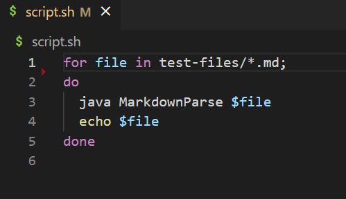
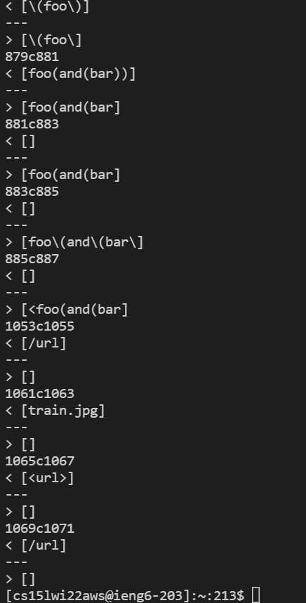
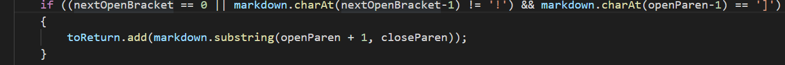
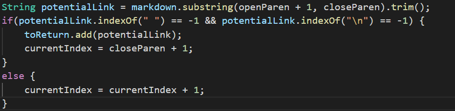

# Week 10 - Lab Report 5

## Way to Find Tests with Different Results.

We use the code we wrote in Lab 9:



Then we store the result in a file named "results.txt" for both our implementation and Joe's implementation. We use the command:

`bash script.sh > results.txt`

We then use `diff` to find the different between the two outputs.

`diff markdown-parse/results.txt joemarkdown/markdown-parse/results.txt`

We see the results:



## Sample Test 1
Test 567:
```
[foo](not a link)


[foo]: /url1
```
- My output: `[not a link]`
- Joe's output : `[]`
- Expected output: `[]`

My implementation is wrong because it doesn't consider spaces between the parenthesis. I should first use the method .trim and then check if there are any spaces between the 'openParen' and 'closeParen'.

Part of code that needs change:


## Sample Test 2
Test 577:
```

```
- My output: `[]`
- Joe's output : `[train.jpg]`
- Expected output: `[]`

Joe's implementation is wrong because it doesn't consider the difference between a link and an image. We can use charAt to see if there is a `!` right before the open basket.

Part of code that needs change:
